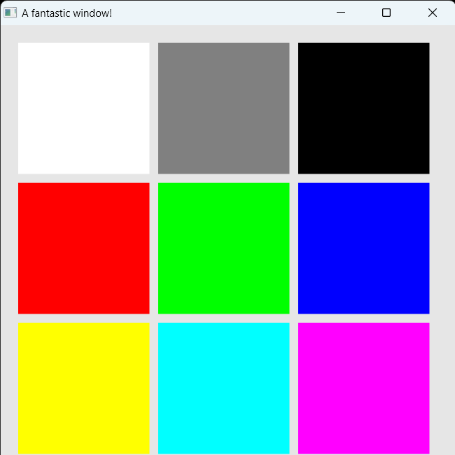
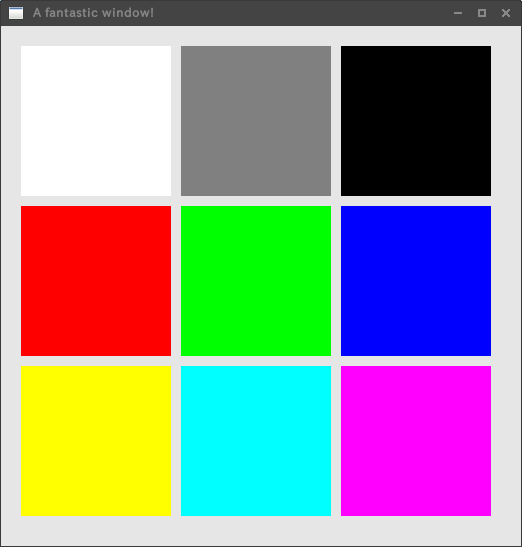

# Bly
## Rusty fast cross-platform 2D graphics library
[](https://github.com/Lattexshz/Bly/actions/workflows/rust-clippy.yml)

  


# Concept
 - ### Easy to use
   
 Bly is easy to use and yet can be called from various windowing libraries using RawWindowHandle.
 To start using Bly, simply write the following code

```rust
let mut canvas = match bly::create_canvas(&window) {
    Ok(c) => c,
    Err(_) => {
        panic!("Can't initialize Bly!");
    }
};
```
For more information and to see an actual sample, click [here](https://github.com/Lattexshz/Bly/blob/documentation/bly/examples/tiles.rs)!

- ### Cross-platform

Bly also aims to work the same way on all platforms.  
Currently supported platforms are Win32 and XLib

## How it can be coded
```Rust
#![allow(clippy::single_match)]

extern crate env_logger as logger;

use bly::{Color, Point2};

use std::env;

use winit::{
    event::{Event, WindowEvent},
    event_loop::EventLoop,
    window::WindowBuilder,
};

fn main() {
    env::set_var("RUST_LOG", "info");

    logger::init();
    let event_loop = EventLoop::new();

    let window = WindowBuilder::new()
        .with_title("A fantastic window!")
        .with_inner_size(winit::dpi::LogicalSize::new(520.0, 520.0))
        .build(&event_loop)
        .unwrap();

    let mut canvas = match bly::create_canvas(&window) {
        Ok(b) => b,
        Err(_) => {
            panic!("Can't initialize Bly!");
        }
    };

    event_loop.run(move |event, _, control_flow| {
        control_flow.set_wait();
        match event {
            Event::WindowEvent {
                event: WindowEvent::CloseRequested,
                window_id,
            } if window_id == window.id() => control_flow.set_exit(),

            Event::MainEventsCleared => canvas.draw(|painter| {
                painter.clear(Color::WhiteGray);

                painter.rectangle(Point2::new(20.0,20.0), Point2::new(150.0,150.0), Color::Rgba(1.0, 1.0, 1.0, 1.0));
                painter.rectangle(Point2::new(180.0,20.0), Point2::new(150.0,150.0), Color::Rgba(0.5, 0.5, 0.5, 1.0));
                painter.rectangle(Point2::new(340.0,20.0), Point2::new(150.0,150.0), Color::Rgba(0.0, 0.0, 0.0, 1.0));

                painter.rectangle(Point2::new(20.0,180.0), Point2::new(150.0,150.0), Color::Rgba(1.0, 0.0, 0.0, 1.0));
                painter.rectangle(Point2::new(180.0,180.0), Point2::new(150.0,150.0), Color::Rgba(0.0, 1.0, 0.0, 1.0));
                painter.rectangle(Point2::new(340.0,180.0), Point2::new(150.0,150.0), Color::Rgba(0.0, 0.0, 1.0, 1.0));

                painter.rectangle(Point2::new(20.0,340.0), Point2::new(150.0,150.0), Color::Rgba(1.0, 1.0, 0.0, 1.0));
                painter.rectangle(Point2::new(180.0,340.0), Point2::new(150.0,150.0), Color::Rgba(0.0, 1.0, 1.0, 1.0));
                painter.rectangle(Point2::new(340.0,340.0), Point2::new(150.0,150.0), Color::Rgba(1.0, 0.0, 1.0, 1.0));
            }),
            _ => (),
        }
    });
}

```

## Output
#### Windows

#### XLib

